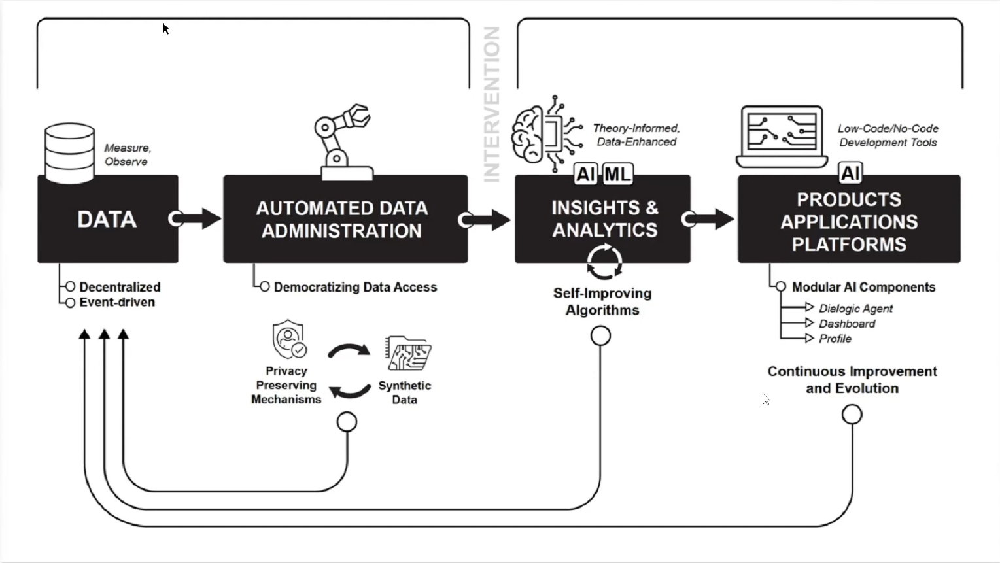
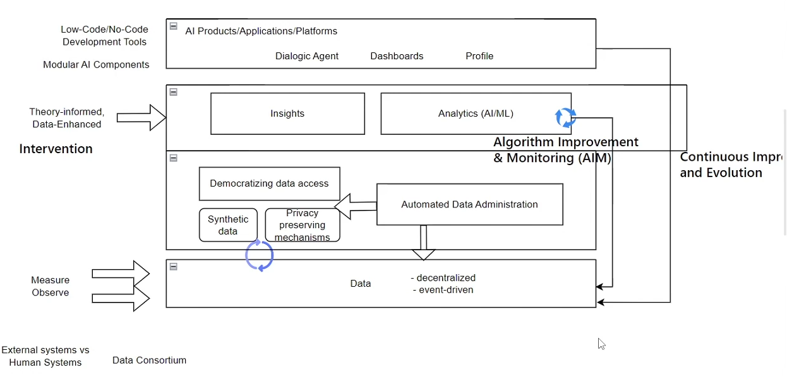

::: details Meeting on 17 Nov 2023
1. [Learner Profiles Blueprint](https://docs.google.com/document/d/1BKK6A0hcB1bZBqqjCLAMJGBt-uVM_doGtygqOFEiJpo/edit#bookmark=id.q2ct4ahs6o4v)
2. [AI in Learning](https://docs.google.com/document/d/1iQtePmaPlxWyzu74FufZM-hzccINoV-Ul8qGHoB5TsM/edit#heading=h.s0u5yyd4yuo7)
3. [Modeling the interaction between resilience and ability in assessments with allowances for multiple attempts](https://www.sciencedirect.com/science/article/abs/pii/S0747563221001709?via%3Dihub)
:::

::: details Meeting on 24 Nov 2023
**Task 1**
    1. [SATURN of githbu official website](https://github.com/snap-stanford/SATURN)
    2. Focus on the Sequences: How to apply to education
    3. Responsible: Kevin

**Task 2**
    Try to find potential useful stuff
    1. http://snap.stanford.edu/
    2. https://github.com/snap-stanford

**Read the papers below**
1. [Motifs in Temporal Networks](https://arxiv.org/abs/1612.09259)
2. [Motifs in Temporal Networks](https://arbenson.github.io/posters/temporal-motifs-wsdm-2017-poster.pdf)
3. [Motifs in Temporal Networks](https://cs.stanford.edu/people/jure/pubs/motifs-wsdm17.pdf)
4. [Using online learner trace data to understand the cohesion ofteams in higher education](https://onlinelibrary.wiley.com/doi/epdf/10.1111/jcal.12829)
:::

::: details Meeting on 01 Dec 2023

:::

::: details Meeting on 08 Dec 2023

**Reading Resources**
[Paul LeBlanc to Leave Presidency of Southern New Hampshire](https://www.insidehighered.com/news/governance/executive-leadership/2023/12/06/paul-leblanc-leave-presidency-southern-new)

[A summary presentation on the Act by the European Commission](https://artificialintelligenceact.eu/the-act/)
[California Consumer Privacy Act (CCPA)](https://oag.ca.gov/privacy/ccpa)
[ARTIFICIAL INTELLIGENCE](https://www.nist.gov/artificial-intelligence)
[American Council on Education](https://www.acenet.edu/Pages/default.aspx)

https://app.mural.co/t/bigideassignalsandtrends7760/m/bigideassignalsandtrends7760/1701781872622/be7ccf9b8888d6739b1d66e1adc1d17b5a518c69?sender=uf5dfef54353a241f80343848

**Tasks**
* What kind of algorithms can be used for Feedback Seeking Behivour.
    * **Responsible:** Haiyue
    * **Direction:** Processing mining/ sequence analysis/ edm/aim
* Emotinal Response to Feedback (positive vs negative)
    * **Responsible:** Kevin
    * **Direction:** Machine learning, etc. 
    * **Data Source:**0 Video/Camera/Text etc.

**Start Point:**
1. [Soft Skills: Free Measurement Tools](https://docs.google.com/document/d/1ydSWkj23Y7Civ3CKMUlsbMQJyKW8brjkzqX8_nJmV44/edit)
2. [Another Resource](https://docs.google.com/presentation/d/1mm0cMiK-rmyd3Ado04aeROAQpxpMXVwJ73ydTvbdKxo/edit#slide=id.p)
:::

